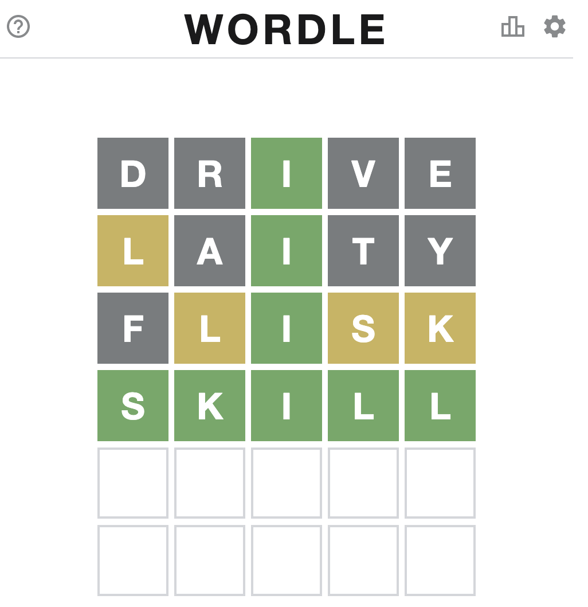

## Description

This is a simple and easy-to-use program to help you find candidate words for Wordle-like word games. All you need is a list of words stored in the plain text format where every line corresponds to a word. `wordle_wl.txt` is the word list used by the [Wordle source code](https://www.powerlanguage.co.uk/wordle/main.c1506a22.js). In case such an exhaustive word list is unavailable, you can simply make one by yourself (although that may be slightly less perfect if your own word list is not exhaustive for the game). 

## Purpose

The main purpose of this program is to help myself to play Wordle-like word games. I always see myself as a competent or an advanced English speaker, but when I played Wordle, I found it hard or unnatural for me to just come up with a 5-letter word based on certain clues, so I have never really passed a game without "cheating". However, when I played [a Chinese version of Wordle](https://cheeaun.github.io/chengyu-wordle/?fbclid=IwAR1zrZZ8ME5SB5q8ILTXZJ7yQ9bGI677E1RSpqkpqVN1B0btwL1W1rbk2so) guessing 4-char idioms, that instantly becomes a piece of cake for me. I can think of possible combinations effortlessly and get my guesses right with few tries (on average around 3 tries or less?) just on my own. 

As a linguist, I realized that this interesting phenomenon may have to do with how I mentally process Chinese and English as a native and a non-native speaker respectively. So I gave up the idea that I could play the original Wordle as well as native English speakers and designed this simple program to give myself hints when playing Wordle. 

## Usage

If you rely on this program entirely to play Wordle game, the game will become no fun. Instead, I would suggest you to utilize this program as something that give hints. In line with this, the program was not designed to automatically play the Wordle-like games on a webpage.  

The following is a test example run on Feb 6, 2022 exclusivly using the program. 

### Initialization

```python
>>> from wordGuesser import Guesser
>>> from random import seed
>>> G = Guesser()
>>> seed(232) # set a random seed so you can reproduce the result
```


### Randomly guessing a word that has no repetitive chars (to maximize hints) 

```python
# by default, out_num=1 (return string) 
>>> G.random_guess(out_num=5) # I chose "drive"
# output: ['molar', 'drive', 'knish', 'cline', 'chins']
```


### Based on hints, conditionally guessing the possible candidate words

Please note that, the inclusion and exclusion conditions can be a str, a tuple (char_str, position_idx), and a list (str and/or tuple combination). 

```python
>>> cands = G.find_candidates(include=('i', 2), 
                              exclude=['d', 'r', 'v', 'e'])
>>> len(cands)
# 432
```

### Randomly guessing a word (no repetitive chars) from the candidate words

```python
>>> G.random_guess()
# output: laity
```

### Repeating the previous two steps until only one answer is found

```python
# G is self callable (equal to G.find_candidates) after initialization
>>> cands = G(include=[('i', 2), 'l'], 
	      exclude=['d', 'r', 'v', 'e', ('l', 0), 'a', 't', 'y'])
>>> len(cands) 
# output: 53
>>> G.random_guess()
# output: flisk
>>> cands = G(include=[('i', 2), 'l', 's', 'k'], 
              exclude=['d', 'r', 'v', 'e', 
                   ('l', 0), 'a', 't', 'y', 
                   'f', ('l', 1), ('s', 3), ('k', -1)])
>>> len(cands)
# output: 1
>>> cands 
# output: ['skill']
```

### Test play

<p align='center'>
 
</p>
